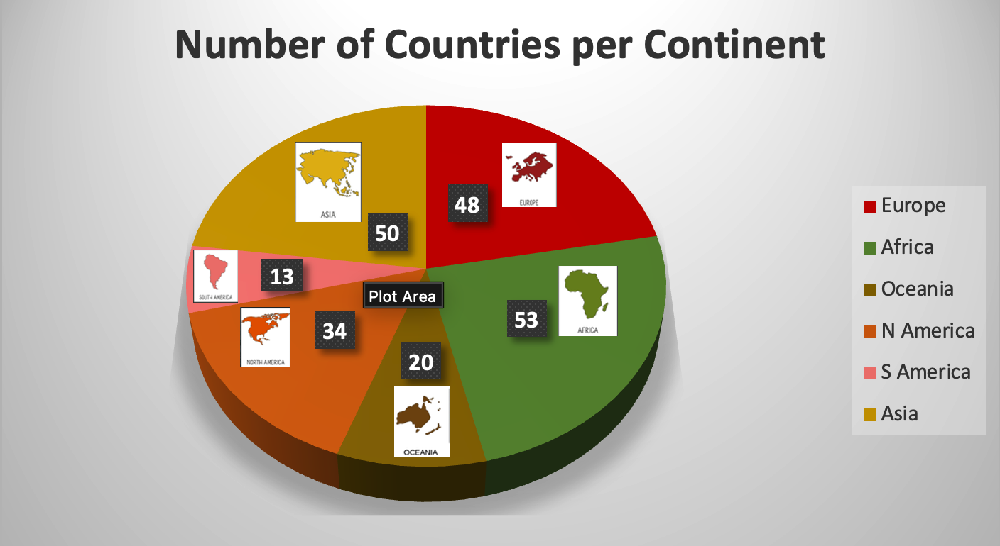

# World Country Data Analysis

## Overview
This project analyzes a global dataset of 218 countries to explore continent-level distributions of countries, GDP, population, and per-capita income using Microsoft Excel.

## Objectives
- Summarize country-level data by continent
- Compute aggregate metrics (GDP, population, income)
- Create enhanced visualizations for data storytelling

## Tools Used
- Microsoft Excel (macOS 2026)
- Pivot tables and aggregate functions
- Custom RGB color matching
- 3D Pie Chart visualization
- PowerPoint for presentation design

## Key Features
- Continent-level summary table
- Total GDP and population aggregation
- Customized 3D pie chart with icon-based enhancement
- Professional presentation slide

## Results
The analysis shows:
- Africa has the highest number of countries (53)
- Asia follows with 50 countries
- South America has the fewest (13)

## Visualization

